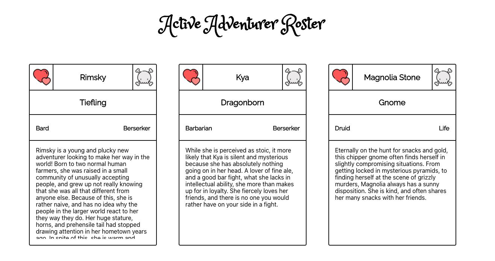
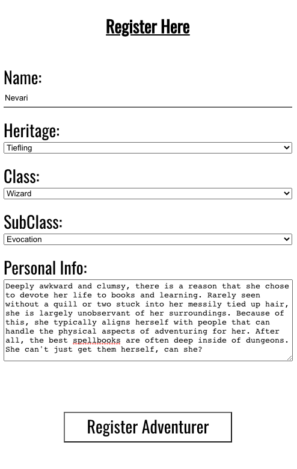
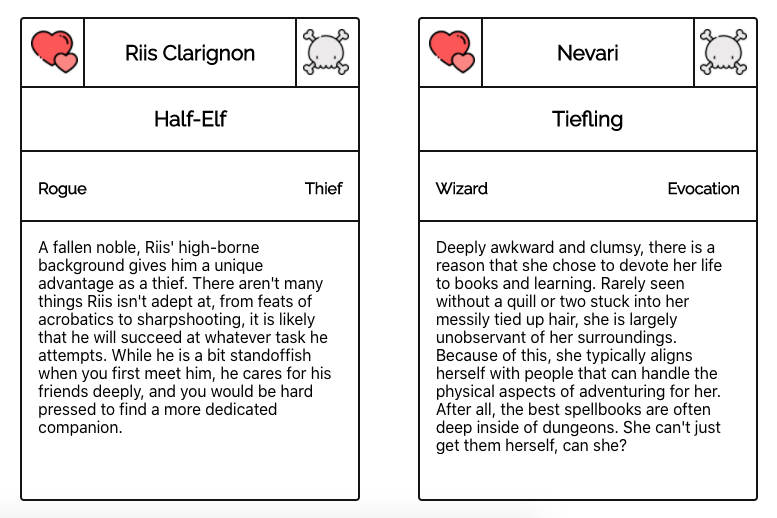

# Wayshrine Guild ; Adventurer Registry

This application focuses on giving the user a place to feel and process their emotions. They are given a space to reflect, to breathe, and to just ruminate.

## Developers
[Brigette Doelp](https://github.com/BrigetteDoelp)

## Project Links
[Project Repo](https://github.com/BrigetteDoelp/wayshrine-adventurer-registry)<br>

## Set-up

  ```
      Fork Repo
      Clone Down Onto Local Machine
      cd Into Repository
      npm install
      npm start
 ```

## Goals and Objectives
- Create a spin up an MPV of my own design
- Robust testing suite
- Make good use of `React.js` and `Router`


## Wins & Challenges
#### Wins:
Creating an application of my own that's been bouncing around in my head for a while now.


#### Challenges:
Getting the 'ideabox' aspect of the application to render properly.

## Functionality Showcase

<p align="center"></br>
  
</p><br>

<p align="center"></br>
  
</p><br>

<p align="center"></br>
  
</p><br>
